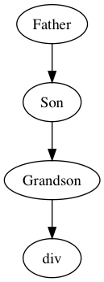

## 从0实现一个tiny react(一)
学习一个库的最好的方法就是实现一个， 注： 实际react的代码可能相去甚远。
### 支持JSX
react组件可以完全不用JSX， 用纯js来写。 JSX语法经过babel转化就是纯js代码， 譬如：
```jsx harmony
const hw = <div>Hello World</div>

const hw = React.createElement('div', null, "Hello World")
```
这两种是等效的。 babel 通过[babylon](https://github.com/babel/babylon) 来把JSX转化为js
配置如下([transform-react-jsx](http://babeljs.io/docs/plugins/transform-react-jsx/))：
```json
{
  "presets": [
    "es2015"
  ],
  "plugins": [
    ["transform-react-jsx", {
      "pragma":  "createElement" // default pragma is React.createElement
    }]
  ]
}
```
所以对于react库本身的， 是不需要关心jsx语法的


### 渲染
react 中virtual-dom的概念， 使用一个 js的结构vnode来描述DOM 节点。 然后， 从vnode构渲染出DOM树。 
这个 vnode由3个属性描述：nodeName(div, Son...), props, children(vnode 组成的数组), 所以 createElement的最简实现
```jsx harmony
function createElement(comp, props, ...args) {
    let children = []
    for(let i = 0; i< args.length;i++){
        if(args[i] instanceof Array) {
            children = children.concat(args[i])
        } else {
            children.push(args[i])
        }
    }
    return {
        nodeName: comp,
        props: props || {},
        children
    }
}
```
从vnode 渲染到dom， 考虑下面的结构
```jsx harmony
class Grandson extends Component {
    render() {
        return React.createElement('div', null, "i am grandson") //<div>i am grandson</div>
    }
}
class Son extends Component {
    render() {
        return  React.createElement(Grandson) // <Grandson/>
    }
}
class Father extends Component {
    render() {
        return React.createElement(Son)//<Son/>
    }
}
```
最终渲染出来的就是一个DOM （一个 div 包含一个TextNode (i am grandson))， 渲染的过程就是递归的处理Component的render， 直到遇到html标签
  1. 当 nodeName 是 html标签， 直接操作dom
  2. 当 nodeName 是 react组件  递归操作 组件render返回的vnode
```jsx harmony
function renderVDOM(vnode) {
    if(typeof vnode == "string") { // 字符串 "i an grandson"
        return vnode
    } else if(typeof vnode.nodeName == "string") {
        let result = {
            nodeName: vnode.nodeName,
            props: vnode.props,
            children: []
        }
        for(let i = 0; i < vnode.children.length; i++) {
            result.children.push(renderVDOM(vnode.children[i]))
        }
        return result
    } else if (typeof vnode.nodeName == "function") {
        let func = vnode.nodeName
        let inst = new func(vnode.props)
        let innerVnode = inst.render()
        return renderVDOM(innerVnode)
    }

``` 
执行上面的结构将返回 ([jsfiddle演示地址](http://jsfiddle.net/yankang/y9jwy5dr/)）)： 
```json
{
  "nodeName": "div",
  "props": {},
  "children": [
    "i am grandson"
  ]
}

```
考虑实际DOM操作， 代码如下： 
```javascript 1.7
function render(vnode, parent) {
    let dom
    if(typeof vnode == "string") {
        dom = document.createTextNode(vnode)
        parent.appendChild(dom)
    } else if(typeof vnode.nodeName == "string") {
        dom = document.createElement(vnode.nodeName)
        setAttrs(dom, vnode.props)
        parent.appendChild(dom)

        for(let i = 0; i < vnode.children.length; i++) {
            render(vnode.children[i], dom)
        }
    } else if (typeof vnode.nodeName == "function") {
        let func = vnode.nodeName
        
        let inst = new func(vnode.props)
        let innerVnode = inst.render()
        render(innerVnode, parent)
    }
}
function setAttrs(dom, props) {
    const allKeys = Object.keys(props)
    allKeys.forEach(k => {
        const v = props[k]

        if(k == "className") {
            dom.setAttribute("class", v)
            return
        }

        if(k == "style") {
            if(typeof v == "string") {
                dom.style.cssText = v
            }

            if(typeof v == "object") {
                for (let i in v) {
                    dom.style[i] =  v[i]
                }
            }
            return

        }

        if(k[0] == "o" && k[1] == "n") {
            const capture = (k.indexOf("Capture") != -1)
            dom.addEventListener(k.substring(2).toLowerCase(), v, capture)
            return
        }

        dom.setAttribute(k, v)
    })
}
```
渲染实际Hello World([jsfiddle演示地址](http://jsfiddle.net/yankang/955u1xvt/))
总结一下： 
1. createElement 方法负责创建 vnode
2. render 方法负责根据生成的vnode， 渲染到实际的dom的一个递归方法 (由于组件 最终一定会render html的标签。 所以这个递归一定是能够正常返回的)
   * vnode是字符串的是， 创建textNode节点
   * 当vnode.nodeName是 字符串的时候， 创建dom节点， 根据props设置节点属性， 遍历render children
   * 当vnode.nodeName是 function的时候， 获取render方法的返回值 vnode'， 执行render(vnode')


**[git代码分支](https://github.com/ykforerlang/tinyreact/tree/simpleRenderNoPropsState)**   
   
### props 和 state
f(props, state) => v 。 组件的渲染结果由 render方法， props， state决定。 基类Component 设置props
```javascript 1.7
function render(vnode, parent) {
    ...
    } else if (typeof vnode.nodeName == "function") {
        let func = vnode.nodeName
        let inst = new func(vnode.props)
        let innerVnode = inst.render()  // this.props
        render(innerVnode, parent)
    }
    ...
}

class Component {
    constructor(props) {
        this.props = props
    }
}
```
对于 state, 当调用组件的setState方法的时候, 简单来说就是渲染一个新DOM树， 替换老的DOM。 所以 
1. 组件实例 必须有机制获取到 olddom
2. 同时 render方法的第二个参数是 parent。 组件实例必须有机制获取到 parentDOM
这2个问题其实是一个问题。  parent = olddom.parentNode 。 这里采用的机制是 每个组件实例 记住 直接渲染出的组件实例／DOM。 下图：

代码实现： 
```javascript 1.7
function render (vnode, parent, comp) {
    let dom
    if(typeof vnode == "string") {
        ...
        comp && (comp.__rendered = dom)
        ...
    } else if(typeof vnode.nodeName == "string") {
        ...
        comp && (comp.__rendered = dom)
        ...
    } else if (typeof vnode.nodeName == "function") {
        ...
        comp && (comp.__rendered = inst)
        ...
    }
}
```
其中 comp 参数代表 "我是被谁渲染的"。 获取olddom的代码实现： 
```javascript 1.7
function getDOM(comp) {
    let rendered = comp.__rendered
    while (rendered instanceof Component) { //判断对象是否是dom
        rendered = rendered.__rendered
    }
    return rendered
}
```
调用 setState 使用olddom替换老的dom 代码如下：
```javascript 1.7
function render(vnode, parent, comp, olddom) {
    let dom
    if(typeof vnode == "string") {
        ...
        if(olddom) {
            parent.replaceChild(dom, olddom)
        } else {
            parent.appendChild(dom)
        }
        ...
    } else if(typeof vnode.nodeName == "string") {
        ...
        if(olddom) {
            parent.replaceChild(dom, olddom)
        } else {
            parent.appendChild(dom)
        }
        ...
    } else if (typeof vnode.nodeName == "function") {
        ...
        render(innerVnode, parent, inst, olddom)
    }
}
```
拼凑一下以上功能， 完整代码实现：
```javascript 1.7
///Component
class Component {
    constructor(props) {
        this.props = props
    }

    setState(state) {
        setTimeout(() => {
            this.state = state
            const vnode = this.render()
            let olddom = getDOM(this)
            render(vnode, olddom.parentNode, this, olddom)
        }, 0)
    }
}


function getDOM(comp) {
    let rendered = comp.__rendered
    while (rendered instanceof Component) { //判断对象是否是dom
        rendered = rendered.__rendered
    }
    return rendered
}

///render
function render (vnode, parent, comp, olddom) {
    let dom
    if(typeof vnode == "string" || typeof vnode == "number") {
        dom = document.createTextNode(vnode)
        comp && (comp.__rendered = dom)
        parent.appendChild(dom)

        if(olddom) {
            parent.replaceChild(dom, olddom)
        } else {
            parent.appendChild(dom)
        }
    } else if(typeof vnode.nodeName == "string") {
        dom = document.createElement(vnode.nodeName)

        comp && (comp.__rendered = dom)
        setAttrs(dom, vnode.props)

        if(olddom) {
            parent.replaceChild(dom, olddom)
        } else {
            parent.appendChild(dom)
        }

        for(let i = 0; i < vnode.children.length; i++) {
            render(vnode.children[i], dom, null, null)
        }
    } else if (typeof vnode.nodeName == "function") {
        let func = vnode.nodeName
        let inst = new func(vnode.props)

        comp && (comp.__rendered = inst)

        let innerVnode = inst.render(inst)
        render(innerVnode, parent, inst, olddom)
    }
}
```
[有状态组件 演示地址](http://jsfiddle.net/yankang/ufhf1fqx/), have fun！

总结一下： render方法负责把vnode渲染到实际的DOM， 如果组件渲染的DOM已经存在， 就替换， 并且保持一个 __rendered的引用链


**[git代码分支](https://github.com/ykforerlang/tinyreact/tree/propsAndState)**


### 敬请期待      
**[从0实现一个tiny react(二) virtual-dom]()** 

**[从0实现一个tiny react(三) 生命周期]()**  
      


