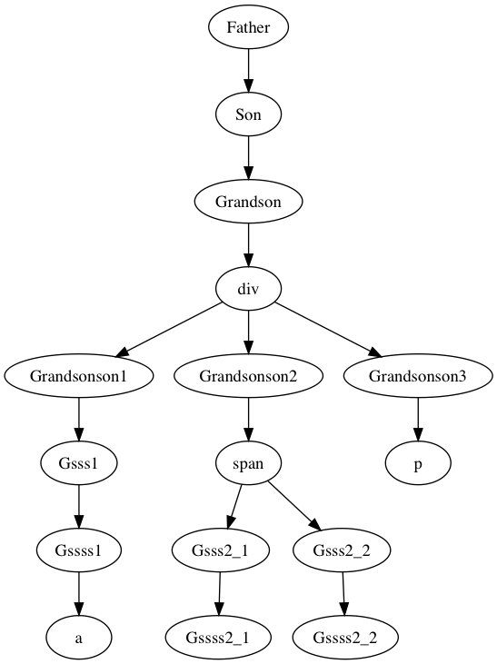
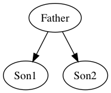
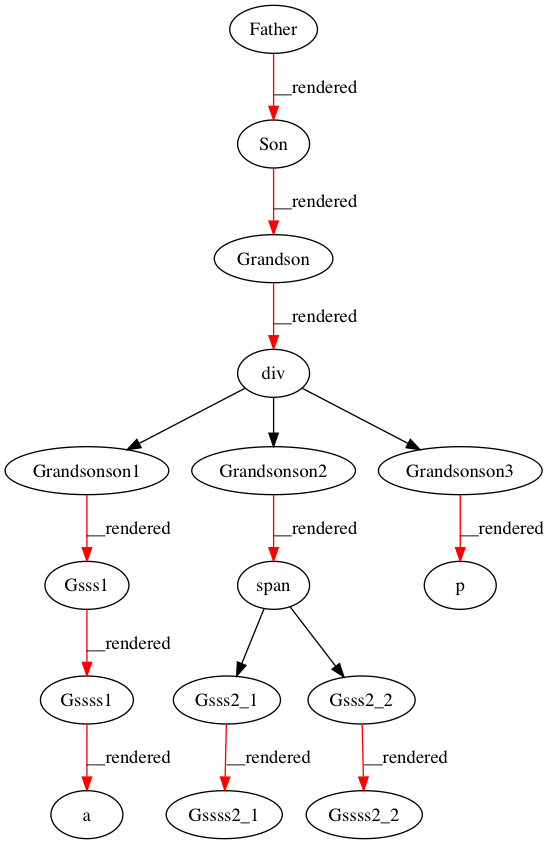
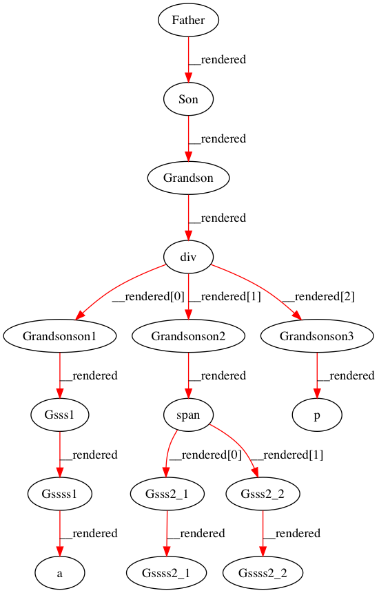

# 从0实现一个tiny react（三）生命周期
在给tinyreact加生命周期之前，先考虑一个 组件实例的复用


### 复用组件实例
render函数 只能返回一个根
```jsx harmony
class A extends Component{
    render() {
        return (<B>...</B>)  
    }
}
class C extends Component {
    render() {
        return (
            <div>
               <C1>...</C1>
               <C2>...</C2>
               <C3>...</C3>
            </div>
        )
    }
}
```
所以 最终的组件树一定是类似这种的 (首字母大写的代表组件， div／span／a...代表原生DOM类型)

是绝对不可能 出现下图这种树结构 (与render函数返回单根的特性矛盾)



假如在 Father里面调用 setState？ 按照现在render 函数的做法:
```javascript 1.7
else if (typeof vnode.nodeName == "function") {
    let func = vnode.nodeName
    let inst = new func(vnode.props)
    ...
}
```

1. 新建 Son 实例
2. 新建 Grandson 实例
3. diff 渲染 div

再次setState呢? 好吧， 再来一次：
1. 新建 Son 实例
2. 新建 Grandson 实例
3. diff 渲染 div

第 3步 就是 [(二)](https://segmentfault.com/a/1190000011052656) 讨论的内容， 会用"最少"的dom操作， 来更新dom到最新的状态。 
对于1， 2 每次setState的时候都会新建inst， 在这里是可以复用之前创建好的inst实例的。 

但是如果一个组件 初始渲染为 '\<A/\>', setState 之后渲染为 '\<B/\>' 这种情况呢？ 那inst就不能复用了， 类比一下 DOM 里的 div --> span
把render 第四个参数 old ---> olddomOrComp ， 通过这个参数来判断 dom 或者inst 是否可以复用：
```jsx harmony
//inst 是否可以复用
function render (vnode, parent, comp, olddomOrComp) {
    ...
    } else if(typeof vnode.nodeName === "string") {
        if(!olddomOrComp || olddomOrComp.nodeName !== vnode.nodeName.toUpperCase()) { // <--- dom 可以复用
             createNewDom(vnode, parent, comp, olddomOrComp, myIndex)
         }
    ...     
    } else if (typeof vnode.nodeName == "function") {
        let func = vnode.nodeName
        let inst
        if(olddomOrComp && olddomOrComp instanceof func) { // <--- inst 可以复用 
            inst = olddomOrComp
            olddomOrComp.props = vnode.props 
        }
        ....
        
        render(innerVnode, parent, inst, inst.__rendered)
```
这里 在最后的 render(innerVnode, parent, inst, olddom) 被改为了： render(innerVnode, parent, inst, inst.__rendered)。 这样是符合 olddomOrComp定义的。
但是 olddom 其实是有2个作用的
1. 判断dom是否可以复用
2. parent.replaceChild(dom, olddom), olddom确定了新的dom的位置
而 olddomOrComp 是做不到第二点。 即使： parent.replaceChild(dom, getDOM(olddomOrComp)) 也是不行的。 原因是：
假如初始 CompA --> <Sub1/>  setState后  CompA --> <Sub2/>， 那么inst 不可以复用， inst.__rendered 是undefined， 就从replaceChild变成了appendChild

怎么解决呢？ 引入第5个参数 myIndex: dom的位置问题都交给这个变量。 olddomOrComp只负责决定 复用的问题

so, 加入myIndex的代码如下： 
```javascript 1.7
/**
 * 替换新的Dom， 如果没有在最后插入
 * @param parent
 * @param newDom
 * @param myIndex
 */
function setNewDom(parent, newDom, myIndex) {
    const old =  parent.childNodes[myIndex]
    if (old) {
        parent.replaceChild(newDom, old)
    } else {
        parent.appendChild(newDom)
    }
}

function render(vnode, parent, comp, olddomOrComp, myIndex) {
    let dom
    if(typeof vnode === "string" || typeof vnode === "number" ) {
        ...
        } else {
           
            dom = document.createTextNode(vnode)
            setNewDom(parent, dom, myIndex)              // <--- 根据myIndex设置 dom
        }
    } else if(typeof vnode.nodeName === "string") {
        if(!olddomOrComp || olddomOrComp.nodeName !== vnode.nodeName.toUpperCase()) {
            createNewDom(vnode, parent, comp, olddomOrComp, myIndex)
        } else {
            diffDOM(vnode, parent, comp, olddomOrComp, myIndex)
        }
    } else if (typeof vnode.nodeName === "function") {
        ...
        let innerVnode = inst.render()
        render(innerVnode, parent, inst, inst.__rendered, myIndex) // <--- 传递 myIndex
    }
}

function createNewDom(vnode, parent, comp, olddomOrComp, myIndex) {
    ...
    setAttrs(dom, vnode.props)

    setNewDom(parent, dom, myIndex)         // <--- 根据myIndex设置 dom

    for(let i = 0; i < vnode.children.length; i++) {
        render(vnode.children[i], dom, null, null, i)  // <--- i 就是myIndex
    }
}

function diffDOM(vnode, parent, comp, olddom) {
    ...
    for(let i = 0; i < vnode.children.length; i++) {
        render(vnode.children[i], olddom, null, renderedArr[i], i)  // <--- i 就是myIndex
    }
    ...
}

```

重新考虑 Father里面调用 setState。 此时已经不会创建新实例了。

那么 假如现在对 Grandson调用setState呢？ 很不幸， 我们需要创建Granssonson1, Granssonson2, Granssonson3， 调用几次， 我们就得跟着新建几次。 
上面的复用方式 并没有解决这个问题, 之前 __rendered 引用链 到 dom就结束了, 如下图。 

把__rendered这条链 完善吧！！

首先 对__rendered 重新定义如下:
1. 当X 是组件实例的时候， __rendered 为X渲染出的 组件实例 或者 dom元素
2. 当X 是dom元素的时候， __rendered 为一个数组， 是X的子组件实例 或者 子dom元素
```
Father --__rendered--> Son  --__rendered--> Grandson --__rendered--> div --__rendered--> [Granssonson1,  Granssonson2, Granssonson3,]
```

在dom 下创建 "直接子节点" 的时候。 需要把这个纪录到dom.__rendered 数组中。 或者说， 如果新建的一个dom元素／组件实例  是dom的 "直接子节点"， 那么需要把它纪录到
parent.__rendered 数组中。 那怎么判断 创建出来的是 "直接子节点" 呢？ 答案是render 第3个参数 comp为null的， 很好理解， comp的意思是 "谁渲染了我"
很明显， 只有 dom下的 "直接子节点" comp才是null， 其他的情况， comp肯定不是null， 比如 Son的comp是Father， Gsss1
的comp是Grandsonson1。。。

当setState重新渲染的时候， 如果老的dom／inst没有被复用， 则应该用新的dom／inst 替换
<br/> 
1. 创建dom的时候。
```javascript 1.7
function createNewDom(vnode, parent, comp, olddomOrComp, myIndex) {
    ...
    if (comp) {
        comp.__rendered = dom
    } else {
        parent.__rendered[myIndex] = dom
    }
    ...
}
```
2. 组件实例
```javascript 1.7
else if (typeof vnode.nodeName == "function") {
    ...
    if(olddomOrComp && olddomOrComp instanceof func) {
        inst = olddomOrComp
    } else {
        inst = new func(vnode.props)

        if (comp) {
            comp.__rendered = inst
        } else {
            parent.__rendered[myIndex] = inst
        }
    }
    ...
}
```
3. diffDOM 的时候： a. remove多余的节点； b. render子节点的时候olddomOrComp = olddom.__rendered[i]
```javascript 1.7
function diffDOM(vnode, parent, comp, olddom) {
    ...
    olddom.__rendered.slice(vnode.children.length)  // <--- 移除多余 子节点
        .forEach(element => {
            olddom.removeChild(getDOM(element))
        })

    olddom.__rendered = olddom.__rendered.slice(0, vnode.children.length)
    for(let i = 0; i < vnode.children.length; i++) {
        render(vnode.children[i], olddom, null, olddom.__rendered[i], i)
    }
    olddom.__vnode = vnode
}
```

所以完整的代码：
```jsx harmony
function render(vnode, parent, comp, olddomOrComp, myIndex) {
    let dom
    if(typeof vnode === "string" || typeof vnode === "number" ) {
        if(olddomOrComp && olddomOrComp.splitText) {
            if(olddomOrComp.nodeValue !== vnode) {
                olddomOrComp.nodeValue = vnode
            }
        } else {
            dom = document.createTextNode(vnode)
            parent.__rendered[myIndex] = dom //comp 一定是null

            setNewDom(parent, dom, myIndex) 
        }
    } else if(typeof vnode.nodeName === "string") {
        if(!olddomOrComp || olddomOrComp.nodeName !== vnode.nodeName.toUpperCase()) {
            createNewDom(vnode, parent, comp, olddomOrComp, myIndex)
        } else {
            diffDOM(vnode, parent, comp, olddomOrComp)
        }
    } else if (typeof vnode.nodeName === "function") {
        let func = vnode.nodeName
        let inst
        if(olddomOrComp && olddomOrComp instanceof func) {
            inst = olddomOrComp
            inst.props = vnode.props
        } else {
            inst = new func(vnode.props)

            if (comp) {
                comp.__rendered = inst
            } else {
                parent.__rendered[myIndex] = inst    
            }
        }

        let innerVnode = inst.render()
        render(innerVnode, parent, inst, inst.__rendered, myIndex)
    }
}

function createNewDom(vnode, parent, comp, olddomOrComp, myIndex) {
    let dom = document.createElement(vnode.nodeName)

    dom.__rendered = []  // 创建dom的 设置 __rendered 引用
    dom.__vnode = vnode

    if (comp) {
        comp.__rendered = dom
    } else {
        parent.__rendered[myIndex] = dom
    }

    setAttrs(dom, vnode.props)

    setNewDom(parent, dom, myIndex) 
            
    for(let i = 0; i < vnode.children.length; i++) {
        render(vnode.children[i], dom, null, null, i)
    }
}

function diffDOM(vnode, parent, comp, olddom) {
    const {onlyInLeft, bothIn, onlyInRight} = diffObject(vnode.props, olddom.__vnode.props)
    setAttrs(olddom, onlyInLeft)
    removeAttrs(olddom, onlyInRight)
    diffAttrs(olddom, bothIn.left, bothIn.right)


    olddom.__rendered.slice(vnode.children.length)
        .forEach(element => {
            olddom.removeChild(getDOM(element))
        })

    const __renderedArr = olddom.__rendered.slice(0, vnode.children.length)
    olddom.__rendered = __renderedArr
    for(let i = 0; i < vnode.children.length; i++) {
        render(vnode.children[i], olddom, null, __renderedArr[i], i) 
    }
    olddom.__vnode = vnode
}

class Component {
    constructor(props) {
        this.props = props
    }

    setState(state) {
        setTimeout(() => {
            this.state = state

          
            const vnode = this.render()
            let olddom = getDOM(this)
            const myIndex = getDOMIndex(olddom)
            render(vnode, olddom.parentNode, this, this.__rendered, myIndex)
        }, 0)
    }
}
function getDOMIndex(dom) {
    const cn = dom.parentNode.childNodes
    for(let i= 0; i < cn.length; i++) {
        if (cn[i] === dom ) {
            return i
        }
    }
}
```

现在 __rendered链 完善了， setState触发的渲染, 都会先去尝试复用 组件实例。 [在线演示](http://jsfiddle.net/yankang/k8ypszLd/)

### 生命周期
前面讨论的__rendered 和生命周期有 什么关系呢？ 生命周期是组件实例的生命周期， 之前的工作起码保证了一点: constructor 只会被调用一次了吧。。。
后面讨论的生命周期 都是基于 "组件实例"的 复用才有意义。tinyreact 将实现以下的生命周期：

1. componentWillMount
2. componentDidMount
3. componentWillReceiveProps
4. shouldComponentUpdate
5. componentWillUpdate
6. componentDidUpdate
7. componentWillUnmount
他们 和 react同名函数 含义相同

##### componentWillMount, componentDidMount, componentDidUpdate
这三个生命周期 是如此之简单： componentWillMount紧接着 创建实例的时候调用； 渲染完成之后，如果
组件是新建的componentDidMount ， 否则：componentDidUpdate
```jsx harmony
else if (typeof vnode.nodeName === "function") {
        let func = vnode.nodeName
        let inst
        if(olddomOrComp && olddomOrComp instanceof func) {
            inst = olddomOrComp
            inst.props = vnode.props
        } else {
            inst = new func(vnode.props)
            inst.componentWillMount && inst.componentWillMount()


            if (comp) {
                comp.__rendered = inst
            } else {
                parent.__rendered[myIndex] = inst
            }
        }

        let innerVnode = inst.render()
        render(innerVnode, parent, inst, inst.__rendered, myIndex)

        if(olddomOrComp && olddomOrComp instanceof func) {
            inst.componentDidUpdate && inst.componentDidUpdate()
        } else {
            inst.componentDidMount && inst.componentDidMount()
        }
    }
```

##### componentWillReceiveProps， shouldComponentUpdate， componentWillUpdate
当组件 获取新的props的时候， 会调用componentWillReceiveProps， 参数为newProps， 并且在这个方法内部this.props 还是值向oldProps,
由于  props的改变 由 只能由 父组件 触发。 所以只用在 render函数里面处理就ok。不过 要在 inst.props = vnode.props 之前调用componentWillReceiveProps:
```jsx harmony
else if (typeof vnode.nodeName === "function") {
        let func = vnode.nodeName
        let inst
        if(olddomOrComp && olddomOrComp instanceof func) {
            inst = olddomOrComp
            inst.componentWillReceiveProps && inst.componentWillReceiveProps(vnode.props) // <-- 在 inst.props = vnode.props 之前调用
            
            inst.props = vnode.props
        } else {
            ...
        }
    }
```

当 组件的 props或者state发生改变的时候，组件一定会渲染吗？shouldComponentUpdate说了算！！ 如果组件没有shouldComponentUpdate这个方法， 默认是渲染的。 
否则是基于 shouldComponentUpdate的返回值。 这个方法接受两个参数 newProps, newState 。 
另外由于 props和 state(setState) 改变都会引起 shouldComponentUpdate调用， 所以: 
```jsx harmony
function render(vnode, parent, comp, olddomOrComp) {
    ...
    else if (typeof vnode.nodeName === "function") {
            let func = vnode.nodeName
            let inst
            if(olddomOrComp && olddomOrComp instanceof func) {
                inst = olddomOrComp
                inst.componentWillReceiveProps && inst.componentWillReceiveProps(vnode.props) // <-- 在 inst.props = vnode.props 之前调用
                
                let shoudUpdate
                if(inst.shouldComponentUpdate) {
                    shoudUpdate = inst.shouldComponentUpdate(vnode.props, olddomOrComp.state) // <-- 在 inst.props = vnode.props 之前调用
                } else {
                    shoudUpdate = true
                }
    
                inst.props = vnode.props   
                if (!shoudUpdate) {   // <-- 在 inst.props = vnode.props  之后
                    return // do nothing just return
                }
                

            } else {
                ...
            }
        }
     ...
}


setState(state) {
    setTimeout(() => {
        let shoudUpdate
        if(this.shouldComponentUpdate) {
            shoudUpdate = this.shouldComponentUpdate(this.props, state)
        } else {
            shoudUpdate = true
        }
        this.state = state
        if (!shoudUpdate) {  // <-- 在  this.state = state  之后
            return // do nothing just return
        }

        const vnode = this.render()
        let olddom = getDOM(this)
        const myIndex = getDOMIndex(olddom)
        render(vnode, olddom.parentNode, this, this.__rendered, myIndex)
        this.componentDidUpdate && this.componentDidUpdate() // <-- 需要调用下： componentDidUpdate
    }, 0)
}
```
当 shoudUpdate 为false的时候呢， 直接return 就ok了， 但是shoudUpdate 为false 只是表明 不渲染， 但是在 return之前， newProps和newState一定要设置到组件实例上。
<br/>**注** setState render之后 也是需要调用： componentDidUpdate

当 shoudUpdate == true 的时候。 会调用： componentWillUpdate， 参数为newProps和newState。 这个函数调用之后，就会把nextProps和nextState分别设置到this.props和this.state中。
```jsx harmony
function render(vnode, parent, comp, olddomOrComp) {
    ...
    else if (typeof vnode.nodeName === "function") {
    ...
    let shoudUpdate
    if(inst.shouldComponentUpdate) {
        shoudUpdate = inst.shouldComponentUpdate(vnode.props, olddomOrComp.state) // <-- 在 inst.props = vnode.props 之前调用
    } else {
        shoudUpdate = true
    }
    shoudUpdate && inst.componentWillUpdate && inst.componentWillUpdate(vnode.props, olddomOrComp.state)   // <-- 在 inst.props = vnode.props 之前调用   
    inst.props = vnode.props   
    if (!shoudUpdate) {   // <-- 在 inst.props = vnode.props  之后
        return // do nothing just return
    }
                
    ...
}


setState(state) {
    setTimeout(() => {
        ...
        shoudUpdate && this.componentWillUpdate && this.componentWillUpdate(this.props, state) // <-- 在 this.state = state 之前调用
        this.state = state
        if (!shoudUpdate) {  // <-- 在  this.state = state  之后
            return // do nothing just return
        }
        ...
}
```

#### componentWillUnmount
当组件要被销毁的时候， 调用组件的componentWillUnmount。 inst没有被复用的时候， 要销毁。 dom没有被复用的时候， 也要销毁， 而且是树形结构
的递归操作。 有点像 render的递归， 直接看代码： 
```jsx harmony
function recoveryComp(comp) {
    if (comp instanceof Component) {  // <--- component
        comp.componentWillUnmount && comp.componentWillUnmount()
        recoveryComp(comp.__rendered)
    } else if (comp.__rendered instanceof Array) { // <--- dom like div/span
        comp.__rendered.forEach(element => {
            recoveryComp(element)
        })
    } else {       // <--- TextNode
        // do nothing
    }
}
```
recoveryComp 是这样的一个 递归函数： 
   * 当domOrComp 为组件实例的时候， 首先调用：componentWillUnmount， 然后 recoveryDomOrComp(inst.__rendered) 。 这里的先后顺序关系很重要
   * 当domOrComp 为DOM节点 （非文本 TextNode）, 遍历 recoveryDomOrComp(子节点) 
   * 当domOrComp 为TextNode，nothing...
与render一样， 由于组件 最终一定会render html的标签。 所以这个递归一定是能够正常返回的。
<br/> 哪些地方需要调用recoveryComp ？ 
1. 所有olddomOrComp 没有被复用的地方。 因为一旦olddomOrComp 不被复用， 一定有一个新的取得它， 它就要被销毁
2. 多余的 子节点。 div 起初有3个子节点， setState之后变成了2个。 多出来的要被销毁
```jsx harmony
function diffDOM(vnode, parent, comp, olddom) {
    const {onlyInLeft, bothIn, onlyInRight} = diffObject(vnode.props, olddom.__vnode.props)
    setAttrs(olddom, onlyInLeft)
    removeAttrs(olddom, onlyInRight)
    diffAttrs(olddom, bothIn.left, bothIn.right)


    const willRemoveArr = olddom.__rendered.slice(vnode.children.length)
    const renderedArr = olddom.__rendered.slice(0, vnode.children.length)
    olddom.__rendered = renderedArr
    for(let i = 0; i < vnode.children.length; i++) {
        render(vnode.children[i], olddom, null, renderedArr[i], i)
    }

    willRemoveArr.forEach(element => {
        recoveryComp(element)
        olddom.removeChild(getDOM(element))
    })

    olddom.__vnode = vnode
}
```

到这里， tinyreact 就有 生命周期了

之前的代码 由于会用到  dom.__rendered。 所以：
```jsx harmony
const root = document.getElementById("root")
root.__rendered = []
render(<App/>, root)
```
为了不要在 调用render之前 设置：__rendered 做个小的改动 ：
```jsx harmony
/**
 * 渲染vnode成实际的dom
 * @param vnode 虚拟dom表示
 * @param parent 实际渲染出来的dom，挂载的父元素
 */
export default function render(vnode, parent) {
    parent.__rendered =[]  //<--- 这里设置 __rendered
    renderInner(vnode, parent, null, null, 0)
}

function renderInner(vnode, parent, comp, olddomOrComp, myIndex) {
    ...
}
```

### 其他
tinyreact 还有很多功能没有实现：
1. context
2. 事件代理
3. 多吃调用setState， 只render一次
4. react 顶层Api
。。。

tinyreat 有些地方参考了[preact](https://github.com/developit/preact) 

**[所有代码托管在git](https://github.com/ykforerlang/tinyreact)** 觉得不错给个 star  😄😄